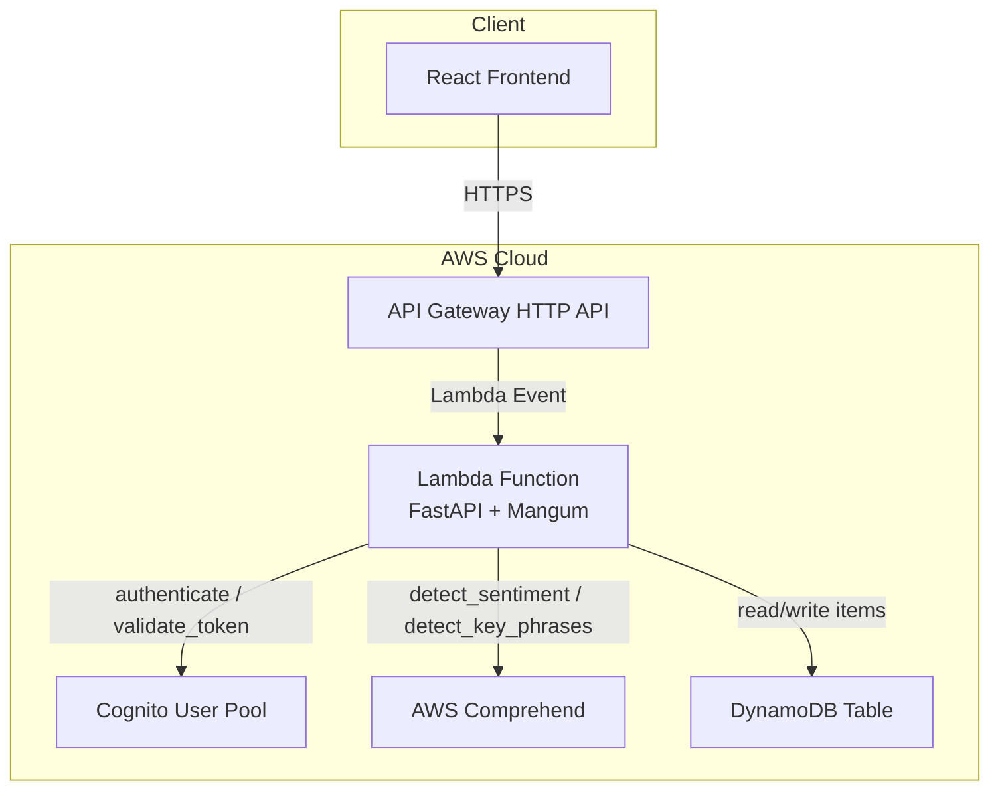
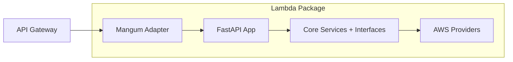
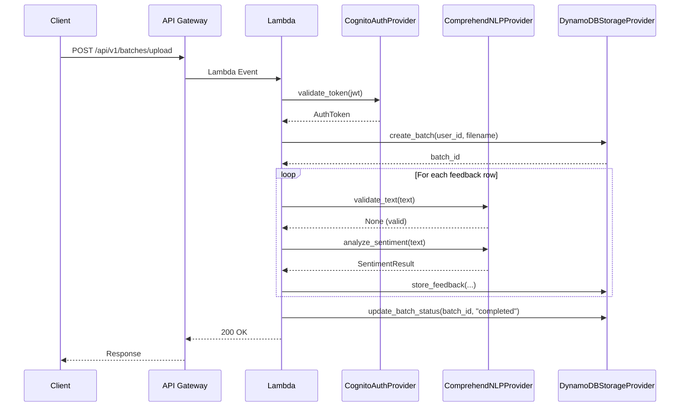
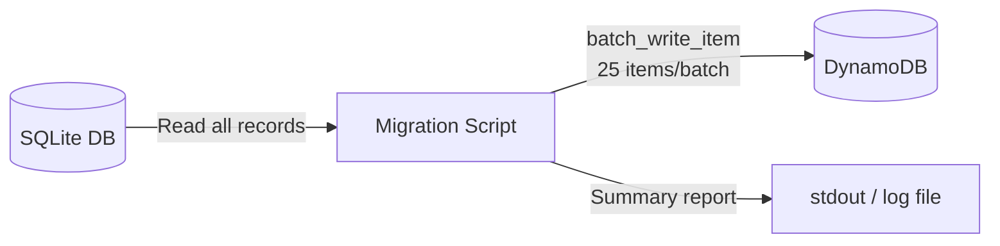

# Design Document: Cloud Migration

## Overview

This design defines the implementation of AWS-managed service replacements for Sentify's backend infrastructure. The migration leverages the existing interface-driven architecture (ABCs) so that new AWS providers are dropped in as alternative implementations — no changes to business logic, services, or API contracts are required.

**Key design decisions:**

1. **Mangum adapter for Lambda** — Rather than rewriting the API layer, we use the Mangum ASGI adapter to run the existing FastAPI application inside AWS Lambda behind API Gateway. This preserves all routes, middleware, validation, and OpenAPI generation with zero code changes to the API layer.

2. **DynamoDB single-table design** — All entities (users, batches, feedbacks, keywords) share a single table with overloaded partition/sort keys. This enables efficient access patterns while keeping operational costs low.

3. **Cognito for auth with JWKS validation** — Cognito handles user creation, password policy enforcement, and token issuance. The provider validates tokens locally using cached JWKS public keys from the Cognito User Pool.

4. **Feature-flag switching** — A `use_local_providers` boolean in Settings lets the system swap between local and AWS providers with a config change, enabling gradual rollout and easy local development.

## Architecture



### Deployment Architecture



**Lambda entry point:**
```python
from mangum import Mangum
from app.main import app

handler = Mangum(app, lifespan="off")
```

The Mangum adapter translates API Gateway events into ASGI requests, routes them through the existing FastAPI application, and converts the response back to the Lambda response format. Lifespan events are disabled since Lambda manages its own lifecycle.

## Components and Interfaces

### New Infrastructure Modules

| Module | File Path | Implements | Replaces |
|--------|-----------|-----------|----------|
| ComprehendNLPProvider | `infrastructure/nlp/comprehend_nlp_provider.py` | INLPProvider | SpaCyNLPProvider |
| CognitoAuthProvider | `infrastructure/auth/cognito_auth_provider.py` | IAuthProvider | LocalAuthProvider |
| DynamoDBStorageProvider | `infrastructure/storage/dynamodb_storage_provider.py` | IStorageProvider | SQLiteStorageProvider |
| Lambda Handler | `lambda_handler.py` (project root) | — | `uvicorn` / `main.py` entry |
| Migration Script | `scripts/migrate_sqlite_to_dynamodb.py` | — | — |

### Component Interactions



### Interface Contracts (Unchanged)

The three ABCs remain exactly as defined:

- **INLPProvider**: `analyze_sentiment(text) → SentimentResult`, `extract_keywords(text, max_keywords) → list[str]`, `validate_text(text) → NLPError | None`
- **IAuthProvider**: `authenticate(email, password) → AuthResult`, `validate_token(token) → AuthToken | None`, `hash_password(password) → str`, `verify_password(password, hashed) → bool`
- **IStorageProvider**: 16 methods for CRUD on users, batches, feedbacks, keywords

### Dependency Injection Updates

```python
# dependencies.py (updated)
from app.config import settings

def get_storage_provider() -> IStorageProvider:
    if settings.use_local_providers:
        return SQLiteStorageProvider(session_factory=get_session)
    else:
        return DynamoDBStorageProvider(
            table_name=settings.dynamodb_table_name,
            region=settings.aws_region,
        )

def get_auth_provider() -> IAuthProvider:
    if settings.use_local_providers:
        storage = get_storage_provider()
        return LocalAuthProvider(storage)
    else:
        return CognitoAuthProvider(
            user_pool_id=settings.cognito_user_pool_id,
            client_id=settings.cognito_app_client_id,
            region=settings.aws_region,
        )

def get_nlp_provider() -> INLPProvider:
    if settings.use_local_providers:
        return SpaCyNLPProvider()
    else:
        return ComprehendNLPProvider(region=settings.aws_region)
```

### ComprehendNLPProvider

**Responsibility:** Delegates NLP analysis to AWS Comprehend for Spanish text.

**Key behaviors:**
- `validate_text`: Local validation (no AWS call) — checks empty, whitespace-only, fewer than 2 significant words, and text exceeding 5000 UTF-8 bytes
- `analyze_sentiment`: Calls `comprehend.detect_sentiment(Text=text, LanguageCode="es")`, computes score as `(Positive - Negative)` clamped to [-1.0, 1.0], classifies using the same thresholds (>0.2 = positivo, <-0.2 = negativo, else neutro)
- `extract_keywords`: Calls `comprehend.detect_key_phrases(Text=text, LanguageCode="es")`, filters to >2 chars, sorts by confidence descending, normalizes to lowercase, returns up to max_keywords (clamped 1-10)

**boto3 client initialization:**
```python
self._client = boto3.client("comprehend", region_name=region)
```

### CognitoAuthProvider

**Responsibility:** User registration, authentication via USER_PASSWORD_AUTH flow, and JWT validation against JWKS.

**Key behaviors:**
- `hash_password`: Returns empty string (no-op — Cognito manages passwords)
- `verify_password`: Returns False (no-op)
- `authenticate`: Calls `cognito.initiate_auth(AuthFlow="USER_PASSWORD_AUTH", ...)`, extracts tokens, maps "sub" → user_id and "custom:company_name" → company_name
- `validate_token`: Fetches JWKS from `https://cognito-idp.{region}.amazonaws.com/{pool_id}/.well-known/jwks.json`, caches keys for 24 hours, validates signature and expiration using PyJWT with RS256
- `register`: Calls `cognito.sign_up(...)` with email as username, stores company_name as custom attribute
- `refresh_token`: Calls `cognito.initiate_auth(AuthFlow="REFRESH_TOKEN_AUTH", ...)`

**JWKS caching strategy:**
```python
class CognitoAuthProvider:
    _jwks_cache: dict | None = None
    _jwks_fetched_at: datetime | None = None
    JWKS_CACHE_TTL = timedelta(hours=24)
```

### DynamoDBStorageProvider

**Responsibility:** Single-table persistence of all entities using boto3 DynamoDB resource.

**Key behaviors:**
- Uses `boto3.resource("dynamodb").Table(table_name)` for all operations
- Generates UUID v4 for all IDs
- Batch writes use chunks of 25 items with exponential backoff (up to 3 retries)
- Atomic counter updates for batch counts via `UpdateExpression` with `ADD`
- Keyword aggregation via query on batch partition + in-memory frequency counting

## Data Models

### DynamoDB Single-Table Schema

**Table name:** Configured via `SENTIFY_DYNAMODB_TABLE_NAME`

| Entity | PK | SK | Attributes |
|--------|----|----|-----------|
| User | `USER#{email}` | `USER#{email}` | id, email, password_hash, company_name, failed_attempts, locked_until, created_at |
| User (by ID) | `USERID#{user_id}` | `USERID#{user_id}` | email (pointer for ID-based lookups) |
| Batch | `USER#{user_id}` | `BATCH#{batch_id}` | id, filename, status, total_rows, processed_rows, error_rows, uploaded_at, completed_at |
| Feedback | `BATCH#{batch_id}` | `FEEDBACK#{feedback_id}` | id, original_text, sentiment, score, keywords, status, error_reason, analyzed_at |
| Keyword | `BATCH#{batch_id}` | `KW#{word}#FEEDBACK#{feedback_id}` | word, feedback_id |

### Global Secondary Indexes

| GSI Name | PK | SK | Purpose |
|----------|----|----|---------|
| GSI1 | `GSI1PK` = `BATCH#{batch_id}` | `GSI1SK` = `FEEDBACK#{analyzed_at}` | Query feedbacks sorted by date |
| GSI2 | `GSI2PK` = `BATCH#{batch_id}#KW#{word}` | `GSI2SK` = `FEEDBACK#{feedback_id}` | Query feedbacks by keyword |

### Access Patterns

| Operation | Key Condition | Filter |
|-----------|--------------|--------|
| get_user_by_email | PK = `USER#{email}`, SK = `USER#{email}` | — |
| get_user_batches | PK = `USER#{user_id}`, SK begins_with `BATCH#` | — |
| get_batch_feedbacks | GSI1PK = `BATCH#{batch_id}`, sorted by GSI1SK | status = "success" |
| get_feedbacks_by_keyword | GSI2PK = `BATCH#{batch_id}#KW#{word}` | — |
| get_top_keywords | PK = `BATCH#{batch_id}`, SK begins_with `KW#` | Aggregate in-memory |
| get_urgent_feedbacks | GSI1PK = `BATCH#{batch_id}` | score < threshold, status = "success" |

### Settings Model (Updated)

```python
class Settings(BaseSettings):
    # Existing fields
    database_url: str = "sqlite:///./sentify.db"
    jwt_secret_key: str = os.getenv("SENTIFY_JWT_SECRET_KEY", "")
    jwt_algorithm: str = "HS256"
    jwt_access_token_expire_minutes: int = 30
    max_login_attempts: int = 5
    lockout_duration_minutes: int = 15
    spacy_model: str = "es_core_news_md"
    max_file_size_mb: int = 10
    max_csv_rows: int = 50000

    # Cloud migration fields
    use_local_providers: bool = True
    aws_region: str = ""
    cognito_user_pool_id: str = ""
    cognito_app_client_id: str = ""
    dynamodb_table_name: str = ""

    model_config = {"env_prefix": "SENTIFY_", "env_file": ".env"}
```

### Migration Script Data Flow



The script reads entities in order (users → batches → feedbacks → keywords), transforms each into the single-table schema, writes in batches of 25 with exponential backoff on throttled requests (up to 5 retries), and outputs a final summary comparing source vs destination counts per entity type.


## Correctness Properties

*A property is a characteristic or behavior that should hold true across all valid executions of a system — essentially, a formal statement about what the system should do. Properties serve as the bridge between human-readable specifications and machine-verifiable correctness guarantees.*

### Property 1: Sentiment score computation and classification consistency

*For any* AWS Comprehend response containing Positive and Negative sentiment scores (floats in [0, 1]), the computed polarity score SHALL equal `round(max(-1.0, min(1.0, Positive - Negative)), 2)`, and the resulting classification SHALL be "positivo" when score > 0.2, "negativo" when score < -0.2, and "neutro" when -0.2 <= score <= 0.2.

**Validates: Requirements 1.3, 1.4, 1.5, 1.6**

### Property 2: Keyword extraction invariants

*For any* list of key phrases returned by AWS Comprehend (each with a text string and confidence float) and any max_keywords integer parameter, the ComprehendNLPProvider's extract_keywords output SHALL: contain only items whose original text is longer than 2 characters, be in descending order of confidence score, be normalized entirely to lowercase, and have length at most `clamp(max_keywords, 1, 10)`.

**Validates: Requirements 1.7, 1.8, 2.1, 2.2, 2.3**

### Property 3: Empty/whitespace input validation

*For any* string composed entirely of whitespace characters (including empty string), calling validate_text SHALL return an NLPError with reason "texto_vacio", and calling extract_keywords SHALL return an empty list without invoking the AWS Comprehend API.

**Validates: Requirements 1.9, 2.5**

### Property 4: Insufficient significant words validation

*For any* non-empty string where the number of whitespace-delimited tokens longer than 2 characters is fewer than 2, calling validate_text SHALL return an NLPError with reason "pocas_palabras".

**Validates: Requirements 1.10**

### Property 5: Oversized text rejection

*For any* input text whose UTF-8 encoded byte length exceeds 5000, calling validate_text SHALL return an NLPError with reason "texto_muy_largo" without making any call to the AWS Comprehend API.

**Validates: Requirements 1.12**

### Property 6: Cognito token claim mapping

*For any* valid JWT payload containing a "sub" string, a "custom:company_name" string, and an "exp" integer timestamp, the CognitoAuthProvider's token extraction logic SHALL produce an AuthToken where user_id equals the "sub" claim, company_name equals the "custom:company_name" claim, and expires_at is a UTC datetime corresponding to the "exp" timestamp.

**Validates: Requirements 4.1, 4.4**

### Property 7: Token validation rejects invalid tokens

*For any* JWT string that is expired (exp < now) or has an invalid signature (does not match any key in the cached JWKS), validate_token SHALL return None.

**Validates: Requirements 4.5**

### Property 8: Cognito no-op password methods

*For any* input string(s), hash_password SHALL return an empty string, and verify_password SHALL return False, regardless of argument values.

**Validates: Requirements 10.1, 10.2**

### Property 9: Feedback text truncation invariant

*For any* text string of any length, when store_feedback or store_feedback_error is called, the stored original_text SHALL have length at most 5000 characters and SHALL equal the first 5000 characters of the input text.

**Validates: Requirements 6.4, 7.4**

### Property 10: Batch creation produces valid structure

*For any* valid user_id and filename strings, create_batch SHALL return a valid UUID v4 string, and the stored batch item SHALL have status "pending", the provided user_id and filename, and an uploaded_at field containing a valid UTC ISO-8601 timestamp.

**Validates: Requirements 6.3, 6.10**

### Property 11: Pagination math invariant

*For any* total number of items (>= 0) and any page_size (> 0), the returned total_pages SHALL equal `ceil(total / page_size)`, the returned items count SHALL be at most page_size, and the returned total SHALL equal the count of eligible items matching the query filters.

**Validates: Requirements 6.5, 6.7, 7.3**

### Property 12: Keyword frequency aggregation correctness

*For any* set of feedback items in a batch, each containing a list of keyword strings, get_top_keywords SHALL return keywords with frequency counts equal to the number of distinct feedbacks containing that keyword, sorted in descending frequency order, limited to the specified count.

**Validates: Requirements 6.6**

### Property 13: Urgent feedback filtering and ordering

*For any* set of feedbacks with various scores and statuses, and any threshold float, get_urgent_feedbacks SHALL return only feedbacks where status is "success" AND score is strictly less than the threshold, ordered by score ascending.

**Validates: Requirements 6.7**

### Property 14: User round-trip persistence

*For any* valid email, password_hash, and company_name, after calling create_user, calling get_user_by_email with the same email SHALL return a dictionary where email, password_hash, and company_name match the original input, failed_attempts equals 0, and locked_until is None.

**Validates: Requirements 6.8, 6.9**

### Property 15: Batch status update with completed_at

*For any* existing batch, when update_batch_status is called with status "completed", the stored batch item SHALL have status "completed" AND a completed_at field containing a valid UTC ISO-8601 timestamp. When called with any other status value, completed_at SHALL remain unchanged.

**Validates: Requirements 6.12, 7.1**

### Property 16: Migration record transformation preserves data

*For any* SQLite record (user, batch, feedback, or keyword), the migration transformation SHALL produce a DynamoDB item where all original field values are preserved unchanged, and the PK and SK follow the single-table schema pattern for that entity type.

**Validates: Requirements 9.2**

### Property 17: AWS startup configuration validation

*For any* combination where use_local_providers is False and at least one of the required AWS environment variables (SENTIFY_AWS_REGION, SENTIFY_COGNITO_USER_POOL_ID, SENTIFY_COGNITO_APP_CLIENT_ID, SENTIFY_DYNAMODB_TABLE_NAME) is missing or empty, the application SHALL raise a configuration error at startup indicating which variable is missing.

**Validates: Requirements 8.5**

## Error Handling

### ComprehendNLPProvider Errors

| Error Source | Handling Strategy | User-Facing Result |
|-------------|-------------------|-------------------|
| AWS Comprehend ThrottlingException | Raise exception with AWS error code | HTTP 500 generic error |
| AWS Comprehend InternalServerException | Raise exception with AWS error code | HTTP 500 generic error |
| Network timeout to Comprehend | Raise exception with descriptive message | HTTP 500 generic error |
| Input text > 5000 UTF-8 bytes | Return NLPError("texto_muy_largo") before API call | Feedback marked as error |
| Empty/whitespace input | Return NLPError("texto_vacio") | Feedback marked as error |

### CognitoAuthProvider Errors

| Error Source | Handling Strategy | User-Facing Result |
|-------------|-------------------|-------------------|
| NotAuthorizedException | Return AuthResult(success=False, error=generic_message) | HTTP 401 |
| UserNotFoundException | Return AuthResult(success=False, error=generic_message) | HTTP 401 (same as invalid) |
| UsernameExistsException | Return AuthResult(success=False, error="email already in use") | HTTP 409 |
| InvalidPasswordException | Return AuthResult(success=False, error=policy_violation_detail) | HTTP 400 |
| UserNotConfirmedException | Return AuthResult(success=False, error="account not confirmed") | HTTP 403 |
| TooManyRequestsException | Return AuthResult(success=False, account_locked=True) | HTTP 429 |
| Cognito service unreachable | Return AuthResult(success=False, error="service unavailable") | HTTP 503 |
| JWKS endpoint unreachable (no cache) | validate_token returns None | HTTP 401 |
| Expired/invalid token | validate_token returns None | HTTP 401 |

### DynamoDBStorageProvider Errors

| Error Source | Handling Strategy | User-Facing Result |
|-------------|-------------------|-------------------|
| ConditionalCheckFailedException (duplicate email) | Raise ValueError("duplicate email") | HTTP 409 |
| ProvisionedThroughputExceededException | Propagate exception (let caller handle) | HTTP 500 |
| ResourceNotFoundException | Propagate exception | HTTP 500 |
| Network/service errors | Propagate exception | HTTP 500 |
| Batch write unprocessed items | Retry with exponential backoff (up to 3 attempts) | Transparent to caller |

### Lambda Handler Error Boundary

The existing FastAPI exception handlers remain in place. Unhandled exceptions are caught at the Mangum adapter level and result in HTTP 500 with a generic message. Full stack traces are logged to CloudWatch via Python's `logging` module.

### Migration Script Error Handling

- Individual record write failures after 5 retries: Log the entity type + record ID, increment failed counter, continue processing
- SQLite read errors: Log and abort (cannot proceed without source data)
- DynamoDB table not found: Abort with clear error message

## Testing Strategy

### Testing Approach

This feature uses a **dual testing approach**:

- **Property-based tests (Hypothesis)**: Verify universal properties across randomly generated inputs for all provider logic (score computation, keyword filtering, pagination, data transformations)
- **Unit tests (pytest + moto)**: Verify specific examples, error conditions, and integration points using AWS service mocks
- **Integration tests**: End-to-end verification with mocked AWS services (moto library)

### Property-Based Testing Configuration

- **Library**: Hypothesis (already in project)
- **Minimum iterations**: 100 per property (via `@settings(max_examples=100)`)
- **Tag format**: Each test includes a docstring with `Feature: cloud-migration, Property {N}: {description}`
- **Mock strategy**: All AWS calls mocked with `unittest.mock.patch` or `moto` to keep tests fast and free of AWS costs

### Test File Organization

```
backend/tests/
├── property/
│   ├── test_comprehend_provider_props.py    # Properties 1-5
│   ├── test_cognito_provider_props.py       # Properties 6-8
│   ├── test_dynamodb_provider_props.py      # Properties 9-15
│   └── test_migration_props.py             # Property 16
├── unit/
│   ├── test_comprehend_provider.py          # Error cases, edge cases
│   ├── test_cognito_provider.py             # Auth flows, error mapping
│   ├── test_dynamodb_provider.py            # CRUD operations, duplicates
│   ├── test_dependencies.py                 # Factory function switching
│   └── test_config_validation.py            # Property 17, startup validation
└── integration/
    ├── test_lambda_handler.py               # End-to-end via Mangum with moto
    └── test_migration_script.py             # Full migration flow with moto
```

### Key Testing Patterns

**Mocking AWS Comprehend responses (Hypothesis):**
```python
@given(
    positive=st.floats(min_value=0, max_value=1),
    negative=st.floats(min_value=0, max_value=1),
)
@settings(max_examples=100)
def test_score_computation_and_classification(positive, negative):
    """Feature: cloud-migration, Property 1: Sentiment score computation and classification consistency"""
    # Mock comprehend response, verify score and classification
```

**Mocking DynamoDB with moto:**
```python
@pytest.fixture
def dynamodb_table():
    with mock_dynamodb():
        # Create table with PK/SK schema and GSIs
        yield table
```

**Hypothesis strategies for domain objects:**
```python
feedback_strategy = st.fixed_dictionaries({
    "text": st.text(min_size=1, max_size=6000),
    "sentiment": st.sampled_from(["positivo", "neutro", "negativo"]),
    "score": st.floats(min_value=-1.0, max_value=1.0),
    "keywords": st.lists(st.text(min_size=3, max_size=50), max_size=10),
})
```

### Dependencies for Testing

- `hypothesis` — Property-based testing (already installed)
- `moto[dynamodb,cognitoidp,comprehend]` — AWS service mocks
- `pytest` — Test runner (already installed)
- `PyJWT[crypto]` — JWT generation for test tokens (RS256 key pairs)
