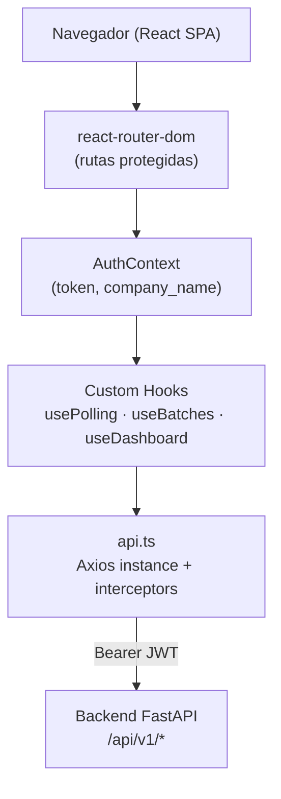
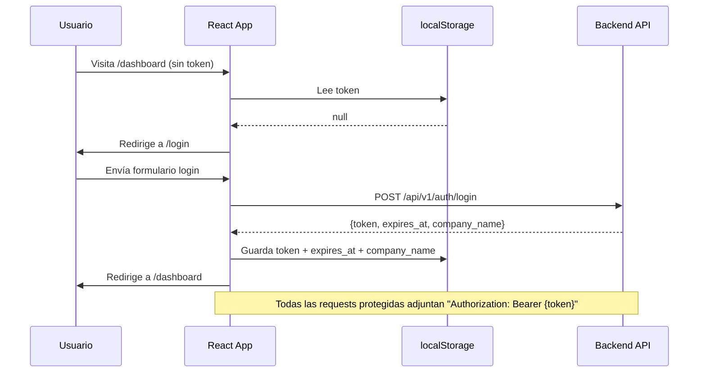
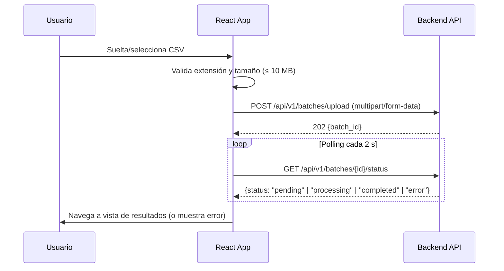

# Design Document — Frontend Dashboard (Sentify)

## Overview

El Dashboard de Sentify es una Single Page Application (SPA) construida con React 18 + TypeScript + Vite. Su único propósito es presentar al Usuario_Corporativo una interfaz fluida para autenticarse, cargar archivos CSV de reseñas y visualizar los resultados del análisis de sentimiento producidos por el backend FastAPI.

**Principios de diseño:**
- Sin lógica de negocio en el frontend. Todo cálculo ocurre en el backend.
- Separación estricta: componentes de UI → custom hooks → capa de servicios HTTP (`api.ts`).
- La autenticación se gestiona exclusivamente mediante JWT almacenado en `localStorage` y adjuntado automáticamente por un interceptor de Axios.
- El estado de la sesión (token, `company_name`) se propaga mediante React Context para evitar prop-drilling.

---

## Architecture

### Diagrama de alto nivel



### Flujo de autenticación



### Flujo de carga y polling



### Decisiones de diseño

- **AuthContext en lugar de Redux**: el estado de autenticación es simple (token + company_name + expiresAt) y no justifica añadir Redux. Un Context con `useReducer` es suficiente.
- **Polling con `setInterval` encapsulado en `usePolling`**: el hook limpia el intervalo al desmontar el componente (evita fugas de memoria) y acepta un callback `shouldStop` para detenerse cuando el estado sea terminal.
- **Filtros de sentimiento y keyword en estado local del dashboard**: los filtros viven en el componente padre del dashboard analítico y se pasan hacia abajo. No se persisten en la URL para mantener la implementación simple; esto puede evolucionar si se requiere deep-linking.
- **`ProtectedRoute` como wrapper de react-router-dom**: verifica el token antes de renderizar el outlet; si el token está ausente o expirado, limpia localStorage y redirige a `/login`.

---

## Components and Interfaces

### Árbol de componentes

```
src/
├── App.tsx                          # Router raíz + AuthProvider
├── components/
│   ├── Auth/
│   │   ├── LoginForm.tsx            # Formulario login (email + password)
│   │   └── RegisterForm.tsx         # Formulario registro (email + password + company_name)
│   ├── Dashboard/
│   │   ├── BatchHistory.tsx         # Lista paginada de lotes con Badge_Urgencia
│   │   ├── FeedbackList.tsx         # Lista paginada de feedbacks con filtros
│   │   ├── SummaryCards.tsx         # Tarjetas de métricas del lote activo
│   │   └── EmptyState.tsx           # Componente reutilizable de estado vacío
│   ├── Upload/
│   │   └── CSVUploader.tsx          # Drag & drop + validación cliente + polling
│   ├── Charts/
│   │   ├── SentimentBarChart.tsx    # Chart.js — barras de distribución de sentimientos
│   │   ├── SentimentPieChart.tsx    # Chart.js — torta de porcentajes
│   │   └── KeywordCloud.tsx         # react-wordcloud — nube de palabras
│   └── Triage/
│       └── TriagePanel.tsx          # Panel de feedbacks urgentes (score < -0.7)
├── hooks/
│   ├── useAuth.ts                   # Consume AuthContext; expone token, companyName, login, logout
│   ├── usePolling.ts                # Polling genérico: intervalo configurable + shouldStop callback
│   ├── useBatches.ts                # Carga paginada de historial de lotes
│   └── useDashboard.ts              # Datos del lote activo: summary, keywords, feedbacks, triage
├── services/
│   └── api.ts                       # Axios instance + interceptores + funciones tipadas por endpoint
├── context/
│   └── AuthContext.tsx              # Provider de estado global de autenticación
├── types/
│   └── index.ts                     # Interfaces TypeScript de todos los esquemas de respuesta
└── routes/
    └── ProtectedRoute.tsx           # HOC que verifica token antes de renderizar el outlet
```

### Interfaces de props de componentes clave

```typescript
// EmptyState — Requisito 12.4
interface EmptyStateProps {
  message: string;
  cta?: React.ReactNode;
}

// BatchHistory row
interface BatchRowProps {
  batch: BatchListItem;
  onSelect: (batchId: string) => void;
}

// CSVUploader
interface CSVUploaderProps {
  onUploadComplete: (batchId: string) => void;
}

// SummaryCards
interface SummaryCardsProps {
  summary: BatchSummary;
}

// FeedbackList
interface FeedbackListProps {
  batchId: string;
  sentimentFilter: 'positivo' | 'neutro' | 'negativo' | null;
  keywordFilter: string | null;
}

// TriagePanel
interface TriagePanelProps {
  batchId: string;
}

// SentimentBarChart / SentimentPieChart
interface SentimentChartProps {
  distribution: { positivo: number; neutro: number; negativo: number };
  onSegmentClick: (sentiment: 'positivo' | 'neutro' | 'negativo' | null) => void;
}

// KeywordCloud
interface KeywordCloudProps {
  keywords: KeywordItem[];
  onWordClick: (word: string | null) => void;
}
```

### Rutas de la aplicación

| Ruta | Componente | Protegida |
|------|-----------|-----------|
| `/` | Redirige a `/dashboard` o `/login` | — |
| `/login` | `LoginForm` | No |
| `/register` | `RegisterForm` | No |
| `/dashboard` | `BatchHistory` + vista analítica | Sí |
| `/upload` | `CSVUploader` | Sí |
| `*` | Página 404 | No |

---

## Data Models

Todas las interfaces TypeScript residen en `frontend/src/types/index.ts` y reflejan exactamente los schemas Pydantic del backend.

```typescript
// POST /api/v1/auth/login → LoginResponse
export interface LoginResponse {
  token: string;
  expires_at: string;        // ISO 8601 datetime
  company_name: string;
}

// GET /api/v1/batches/{id}/status → BatchStatus
export interface BatchStatus {
  batch_id: string;
  status: 'pending' | 'processing' | 'completed' | 'error';
  total_rows: number;
  processed_rows: number;
  error_rows: number;
  uploaded_at: string;       // ISO 8601
  completed_at: string | null;
}

// GET /api/v1/batches/{id}/summary → BatchSummary
export interface BatchSummary {
  batch_id: string;
  total_feedbacks: number;
  sentiment_distribution: {
    positivo: number;
    neutro: number;
    negativo: number;
  };
  sentiment_percentages: {
    positivo: number;
    neutro: number;
    negativo: number;
  };
  urgent_count: number;
}

// GET /api/v1/batches/{id}/feedbacks items → FeedbackItem
export interface FeedbackItem {
  id: string;
  original_text: string;
  sentiment: 'positivo' | 'neutro' | 'negativo';
  score: number;             // -1.0 a 1.0
  keywords: string[];
  analyzed_at: string;       // ISO 8601
}

// GET /api/v1/batches/{id}/keywords items → KeywordItem
export interface KeywordItem {
  word: string;
  frequency: number;
}

// Paginación genérica
export interface PaginatedResponse<T> {
  items: T[];
  total: number;
  page: number;
  page_size: number;
  total_pages: number;
}

// Item del historial de lotes (GET /api/v1/batches)
export interface BatchListItem {
  id: string;
  filename: string;
  status: 'pending' | 'processing' | 'completed' | 'error';
  total_rows: number;
  processed_rows: number;
  error_rows: number;
  uploaded_at: string;
  completed_at: string | null;
  urgent_count: number;
}
```

### Estado global de autenticación (`AuthContext`)

```typescript
interface AuthState {
  token: string | null;
  companyName: string | null;
  expiresAt: Date | null;
}

interface AuthContextValue extends AuthState {
  login: (token: string, expiresAt: string, companyName: string) => void;
  logout: () => void;
  isAuthenticated: () => boolean;  // verifica token != null && Date.now() < expiresAt
}
```

### Estado de filtros del dashboard analítico

```typescript
interface DashboardFilters {
  activeBatchId: string | null;
  sentimentFilter: 'positivo' | 'neutro' | 'negativo' | null;
  keywordFilter: string | null;
}
```

### Funciones puras utilitarias (en `src/utils/`)

Estas funciones no tienen efectos secundarios y son las candidatas a property-based testing:

```typescript
// Detecta si un JWT (decodificando su payload sin verificar firma) ha expirado
function isTokenExpired(token: string): boolean

// Valida un archivo antes de enviarlo al backend
function validateFileBeforeUpload(file: { name: string; size: number }): {
  valid: boolean;
  error?: string;
}

// Valida los campos del formulario de login/registro en el cliente
function validateLoginForm(
  email: string,
  password: string
): Record<string, string>   // campos con errores → mensaje

function validateRegisterForm(
  email: string,
  password: string,
  companyName: string
): Record<string, string>
```

---

## Correctness Properties

*Una propiedad es una característica o comportamiento que debe ser verdadero en todas las ejecuciones válidas del sistema — esencialmente, un enunciado formal sobre lo que el software debe hacer. Las propiedades sirven como puente entre las especificaciones legibles por humanos y las garantías de corrección verificables automáticamente.*

### Reflexión de propiedades (consolidación)

Del análisis de prework se identificaron las siguientes propiedades únicas tras eliminar redundancias:

- 1.5 y 1.6 (rutas protegidas sin token) se consolidan en **Property 1**.
- 3.2 (interceptor adjunta JWT) refuerza **Property 1** desde la perspectiva del cliente HTTP.
- 4.2 y 4.3 (validación de archivo) se consolidan en **Property 2**.
- 4.7 y 4.8 (polling termina en estado terminal) se consolidan en **Property 3**.
- 7.4 y 9.3 (filtro por sentimiento) son el mismo comportamiento → **Property 4**.
- 7.5 y 8.4 (quitar filtro restaura estado) son el mismo patrón → **Property 5** (toggle de filtro).
- 8.3 y 9.4 (filtro por keyword) → **Property 6**.
- 5.2, 5.3 y 10.3 (completitud del renderizado) → **Properties 7, 8**.
- 2.5 y validación de formularios → **Property 9**.
- 12.1–12.4 (EmptyState reutilizable) → **Property 10**.
- 13.3 (indicador de carga en operaciones asíncronas) → **Property 11**.

---

### Property 1: Las rutas protegidas redirigen a /login sin token válido

*Para cualquier* ruta protegida (`/dashboard`, `/upload`) y para cualquier estado del token — ausente, expirado (campo `exp` en el pasado), o malformado — al intentar acceder a esa ruta el sistema debe redirigir al usuario a `/login` sin renderizar el contenido protegido, y si hay un token expirado en `localStorage` debe ser eliminado.

**Validates: Requirements 1.5, 1.6, 11.3**

### Property 2: La validación de archivo rechaza cualquier archivo inválido

*Para cualquier* archivo cuya extensión no sea `.csv`, o cuyo tamaño supere 10 485 760 bytes (10 MB), la función `validateFileBeforeUpload` debe retornar `{ valid: false }` con un mensaje de error descriptivo. Para cualquier archivo `.csv` cuyo tamaño sea ≤ 10 MB, debe retornar `{ valid: true }`.

**Validates: Requirements 4.2, 4.3**

### Property 3: El polling cesa en cualquier estado terminal del lote

*Para cualquier* `batch_id`, cuando el estado devuelto por el endpoint de status sea `'completed'` o `'error'`, el hook `usePolling` debe dejar de invocar el endpoint de status y no realizar ninguna llamada adicional, independientemente de cuántas iteraciones previas haya tenido.

**Validates: Requirements 4.7, 4.8**

### Property 4: El filtro por sentimiento garantiza consistencia en la lista de feedbacks

*Para cualquier* categoría de sentimiento seleccionada (`'positivo'`, `'neutro'`, `'negativo'`), todos los feedbacks mostrados en la lista deben tener ese valor en su campo `sentiment`. Ningún feedback con un sentimiento diferente al filtro activo debe aparecer en la lista visible.

**Validates: Requirements 7.4, 9.3**

### Property 5: El toggle de filtro restaura el estado original (round-trip)

*Para cualquier* filtro activo (sentimiento o keyword), hacer clic nuevamente en el mismo elemento que activó el filtro debe producir el estado sin filtro, idéntico al estado previo a la primera activación — la lista debe mostrar todos los feedbacks del lote sin ningún filtro aplicado.

**Validates: Requirements 7.5, 8.4**

### Property 6: El filtro por keyword adjunta el parámetro correcto al endpoint

*Para cualquier* keyword seleccionada desde la nube de palabras, la solicitud enviada al backend debe ser `GET /api/v1/batches/{id}/feedbacks?keyword={palabra}` con exactamente esa palabra. Todos los feedbacks recibidos y mostrados provienen de esa consulta filtrada.

**Validates: Requirements 8.3, 9.4**

### Property 7: El renderizado de feedbacks incluye todos los campos requeridos

*Para cualquier* `FeedbackItem` (tanto en la lista de feedbacks como en el Panel_Triaje), el componente que lo renderiza debe mostrar en el DOM el texto original completo, el badge de sentimiento, el score numérico y las keywords asociadas. Ningún campo puede estar ausente.

**Validates: Requirements 9.2, 10.3**

### Property 8: El Badge_Urgencia es visible si y solo si urgent_count > 0

*Para cualquier* `BatchListItem`, si `urgent_count > 0` entonces el Badge_Urgencia debe estar visible junto al nombre del lote; si `urgent_count === 0` entonces el Badge_Urgencia no debe aparecer.

**Validates: Requirements 5.3, 10.5**

### Property 9: La validación de formulario rechaza cualquier entrada inválida

*Para cualquier* combinación de campos de formulario en login o registro donde: el email no tenga formato válido, la contraseña tenga menos de 8 caracteres, o algún campo requerido esté vacío — la función de validación debe retornar al menos un error y el formulario no debe enviar la solicitud HTTP.

**Validates: Requirements 1, 2.5**

### Property 10: EmptyState renderiza siempre el mensaje y el CTA si se proporciona

*Para cualquier* string `message` y cualquier elemento React `cta` opcional pasados como props al componente `EmptyState`, el componente debe renderizar el `message` en el DOM; si `cta` fue proporcionado, también debe estar en el DOM.

**Validates: Requirements 12.4**

### Property 11: Las operaciones asíncronas muestran un indicador de carga

*Para cualquier* llamada HTTP en curso (estado `loading: true` en el hook correspondiente), el componente asociado debe mostrar un indicador de carga visible (spinner o skeleton) en el DOM. El indicador debe desaparecer cuando la operación se complete o falle.

**Validates: Requirements 13.3**

---

## Error Handling

### Estrategia por código HTTP

| Código | Origen | Acción del frontend |
|--------|--------|---------------------|
| 401 | Cualquier endpoint protegido | Eliminar token de `localStorage`, redirigir a `/login` |
| 409 | `POST /auth/register` | Mostrar error en campo email: "El correo ya está registrado" |
| 422 | Cualquier endpoint | Propagar el mensaje detallado del backend al componente que hizo la llamada |
| 423 | `POST /auth/login` | Mostrar: "La cuenta ha sido bloqueada temporalmente" |
| 500 | Cualquier endpoint | Toast genérico: "Ocurrió un error inesperado. Por favor, inténtalo de nuevo" |
| Red / timeout | Cualquier endpoint | Toast: "No se pudo conectar con el servidor. Verifica tu conexión" |

### Interceptor de Axios centralizado

El interceptor de respuesta en `api.ts` maneja los casos globales (401, 500). Los errores 409, 422 y 423 se propagan como `AxiosError` al componente que originó la llamada para mostrar mensajes contextuales:

```typescript
axiosInstance.interceptors.response.use(
  (response) => response,
  (error: AxiosError) => {
    if (error.response?.status === 401) {
      localStorage.removeItem('token');
      localStorage.removeItem('expires_at');
      localStorage.removeItem('company_name');
      window.location.href = '/login';
    }
    if (error.response?.status === 500) {
      showToast('Ocurrió un error inesperado. Por favor, inténtalo de nuevo.');
    }
    if (!error.response) {
      showToast('No se pudo conectar con el servidor. Verifica tu conexión.');
    }
    return Promise.reject(error);
  }
);
```

### Resiliencia del polling

Si el endpoint de status devuelve un error de red durante el polling, `usePolling` reintenta hasta 3 veces con back-off exponencial (2 s → 4 s → 8 s). Si los 3 reintentos fallan, el hook detiene el polling y notifica al componente vía callback `onError`.

---

## Testing Strategy

### Evaluación de Property-Based Testing

Este feature es una SPA con operaciones de UI, navegación, llamadas HTTP y renderizado condicional. La mayoría de los criterios de aceptación involucran flujos de usuario, estados visuales y comunicación con servicios externos — estas categorías no se benefician de PBT en el sentido clásico.

Sin embargo, el proyecto define **funciones puras con propiedades universales verificables** en `src/utils/` que sí son candidatas ideales para PBT:
- `isTokenExpired(token)` — cualquier token con `exp` en el pasado debe retornar `true`
- `validateFileBeforeUpload(file)` — cualquier archivo inválido debe retornar `{ valid: false }`
- `validateLoginForm(email, password)` — cualquier entrada inválida debe retornar errores
- `validateRegisterForm(email, password, companyName)` — ídem

Para estas funciones se usará **fast-check** (librería PBT para TypeScript), con mínimo 100 iteraciones por propiedad.

Los componentes React con propiedades universales (Properties 7, 8, 10) se testean también con fast-check generando props aleatorias y verificando el DOM resultante con React Testing Library.

### Enfoque dual

| Tipo | Herramienta | Objetivo |
|------|------------|---------|
| Componentes + lógica pura | React Testing Library + fast-check | Comportamiento de UI, validaciones, propiedades universales |
| End-to-end | Cypress o Playwright | Flujos completos contra backend real/mockeado |

### Tests de componentes (React Testing Library)

| Componente | Escenarios cubiertos |
|------------|---------------------|
| `LoginForm` | Login exitoso guarda token y redirige; 401 muestra error genérico; 423 muestra mensaje de bloqueo; campos vacíos no envían |
| `RegisterForm` | Registro exitoso redirige a `/login`; 409 muestra error en email; 422 muestra mensaje específico; campos vacíos no envían |
| `CSVUploader` | Archivo no-CSV rechazado; archivo > 10 MB rechazado; upload exitoso inicia polling; estado `completed` navega; estado `error` muestra mensaje |
| `BatchHistory` | Lista renderiza con campos completos; Badge_Urgencia visible si `urgent_count > 0`; EmptyState si lista vacía; click en lote dispara carga |
| `SummaryCards` | Todos los campos de `BatchSummary` visibles; EmptyState si `total_feedbacks === 0` |
| `FeedbackList` | Filtro sentimiento actualiza lista; filtro keyword llama endpoint correcto; paginación mantiene filtro; EmptyState si sin resultados |
| `TriagePanel` | Solo feedbacks con score < -0.7; EmptyState si no hay urgentes; renderiza texto, score y keywords |
| `EmptyState` | Renderiza message siempre; renderiza CTA solo si se provee |
| `ProtectedRoute` | Sin token redirige a `/login`; token expirado limpia localStorage y redirige |

### Property tests (fast-check)

```typescript
import fc from 'fast-check';

// Feature: frontend-dashboard, Property 2: La validación de archivo rechaza cualquier archivo inválido
fc.assert(fc.property(
  fc.oneof(
    // Extensión incorrecta, cualquier tamaño
    fc.record({
      name: fc.string().filter(s => s.length > 0 && !s.toLowerCase().endsWith('.csv')),
      size: fc.nat()
    }),
    // Extensión correcta pero tamaño excedido
    fc.record({
      name: fc.constant('reseñas.csv'),
      size: fc.integer({ min: 10_485_761 })
    })
  ),
  (fileProps) => validateFileBeforeUpload(fileProps).valid === false
), { numRuns: 100 });
// Feature: frontend-dashboard, Property 2

// Feature: frontend-dashboard, Property 9: Validación de formulario rechaza entradas inválidas
fc.assert(fc.property(
  fc.record({
    email: fc.oneof(
      fc.constant(''),
      fc.string().filter(s => !s.includes('@'))
    ),
    password: fc.string({ maxLength: 7 })
  }),
  (fields) => Object.keys(validateLoginForm(fields.email, fields.password)).length > 0
), { numRuns: 100 });
// Feature: frontend-dashboard, Property 9

// Feature: frontend-dashboard, Property 1: JWT expirado es detectado
fc.assert(fc.property(
  fc.integer({ max: Math.floor(Date.now() / 1000) - 1 }),
  (expiredAt) => isTokenExpired(buildJwtWithExp(expiredAt)) === true
), { numRuns: 100 });
// Feature: frontend-dashboard, Property 1
```

### Tests e2e (Cypress / Playwright)

| Flujo | Descripción |
|-------|-------------|
| Auth completo | Registro → Login → ver `company_name` en navbar → Logout → redirige a `/login` |
| Upload y polling | Subir CSV válido → polling visible → estado `completed` → navegar automáticamente a resultados |
| Dashboard analítico | Seleccionar lote → ver tarjetas, gráficos y nube de palabras cargados |
| Filtro por sentimiento | Hacer clic en segmento del gráfico → lista filtrada → segundo clic quita filtro |
| Filtro por keyword | Hacer clic en palabra de la nube → lista filtrada → segundo clic quita filtro |
| Triage | Navegar a Panel_Triaje → solo feedbacks con score < -0.7 visibles; EmptyState si no hay urgentes |
| Rutas protegidas | Acceder a `/dashboard` sin token → redirige a `/login`; token expirado → igual |
| 404 | Navegar a ruta inexistente → página de error con enlace de retorno |
