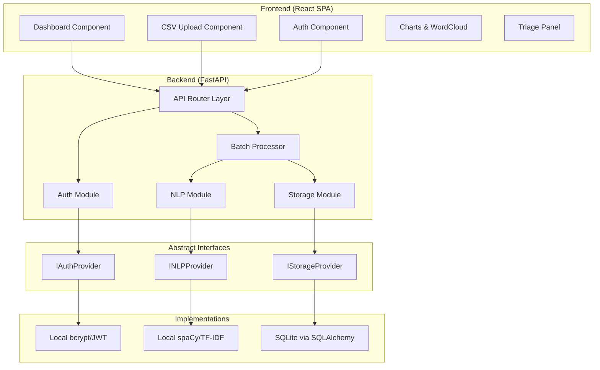
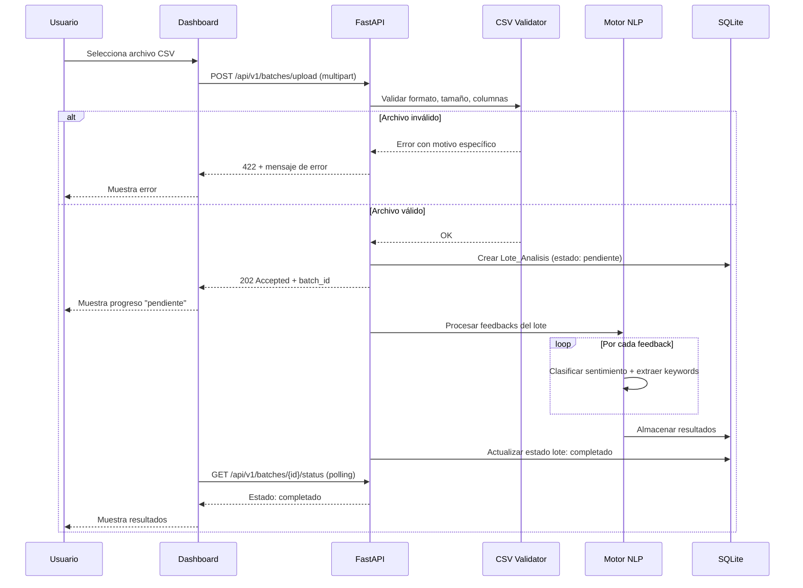
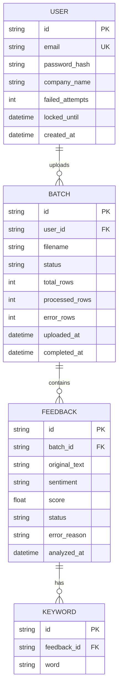

# Design Document: Sentiment Analysis Platform (Sentify)

## Overview

Sentify es una plataforma de análisis de sentimiento que permite a usuarios corporativos cargar archivos CSV con reseñas de clientes, procesarlos con NLP para clasificar sentimiento y extraer palabras clave, y visualizar los resultados en un dashboard interactivo con triaje de urgencia.

La arquitectura sigue un patrón de capas desacopladas con interfaces abstractas para NLP, autenticación y persistencia, facilitando una futura migración a servicios cloud (AWS Comprehend, Cognito, RDS).

### Decisiones de Diseño Clave

| Decisión | Elección | Justificación |
|----------|----------|---------------|
| Framework backend | FastAPI | Soporte nativo async, validación con Pydantic, generación automática de OpenAPI |
| Base de datos | SQLite con SQLAlchemy | Ligero para desarrollo local, abstracción ORM facilita migración |
| Motor NLP | spaCy (es_core_news_md) + scikit-learn TF-IDF | Modelos pre-entrenados en español, rendimiento adecuado para < 2s por feedback |
| Frontend | React + Chart.js + react-wordcloud | Librería madura, buen ecosistema de visualización |
| Autenticación | bcrypt + PyJWT | Estándar de industria, sin dependencias cloud |
| Patrón arquitectónico | Dependency Injection via interfaces abstractas (ABC) | Intercambiabilidad de módulos sin modificar consumidores |

## Architecture

### Diagrama de Componentes de Alto Nivel



### Diagrama de Secuencia: Flujo de Carga y Análisis CSV



### Estructura del Proyecto

```
sentify/
├── backend/
│   ├── app/
│   │   ├── __init__.py
│   │   ├── main.py                  # FastAPI app entry point
│   │   ├── config.py                # Configuración y variables de entorno
│   │   ├── dependencies.py          # Inyección de dependencias
│   │   ├── api/
│   │   │   ├── __init__.py
│   │   │   ├── routes/
│   │   │   │   ├── auth.py          # Endpoints de autenticación
│   │   │   │   ├── batches.py       # Endpoints de lotes y upload
│   │   │   │   └── dashboard.py     # Endpoints de visualización
│   │   │   └── middleware/
│   │   │       └── auth_middleware.py
│   │   ├── core/
│   │   │   ├── __init__.py
│   │   │   ├── interfaces/
│   │   │   │   ├── nlp_provider.py      # INLPProvider ABC
│   │   │   │   ├── auth_provider.py     # IAuthProvider ABC
│   │   │   │   └── storage_provider.py  # IStorageProvider ABC
│   │   │   ├── models/
│   │   │   │   ├── batch.py
│   │   │   │   ├── feedback.py
│   │   │   │   ├── keyword.py
│   │   │   │   └── user.py
│   │   │   └── services/
│   │   │       ├── batch_service.py
│   │   │       ├── nlp_service.py
│   │   │       └── auth_service.py
│   │   ├── infrastructure/
│   │   │   ├── __init__.py
│   │   │   ├── nlp/
│   │   │   │   └── spacy_nlp_provider.py
│   │   │   ├── auth/
│   │   │   │   └── local_auth_provider.py
│   │   │   └── storage/
│   │   │       ├── sqlite_storage_provider.py
│   │   │       └── database.py
│   │   └── utils/
│   │       ├── csv_parser.py
│   │       └── validators.py
│   ├── tests/
│   │   ├── unit/
│   │   ├── integration/
│   │   └── property/
│   ├── requirements.txt
│   └── pyproject.toml
├── frontend/
│   ├── src/
│   │   ├── components/
│   │   │   ├── Auth/
│   │   │   ├── Dashboard/
│   │   │   ├── Upload/
│   │   │   ├── Charts/
│   │   │   └── Triage/
│   │   ├── services/
│   │   │   └── api.ts
│   │   ├── hooks/
│   │   ├── types/
│   │   └── App.tsx
│   ├── package.json
│   └── vite.config.ts
└── docs/
    └── openapi.yaml
```

## Components and Interfaces

### 1. Interfaces Abstractas (Contratos)

#### INLPProvider

```python
from abc import ABC, abstractmethod
from dataclasses import dataclass

@dataclass
class SentimentResult:
    sentiment: str        # "positivo" | "neutro" | "negativo"
    score: float          # -1.0 a 1.0, precisión 2 decimales
    keywords: list[str]   # 1-10 palabras clave en minúsculas

@dataclass
class NLPError:
    feedback_id: str
    reason: str           # "texto_vacio" | "pocas_palabras" | "idioma_no_soportado"

class INLPProvider(ABC):
    @abstractmethod
    def analyze_sentiment(self, text: str) -> SentimentResult:
        """Analiza sentimiento de un texto individual."""
        ...

    @abstractmethod
    def extract_keywords(self, text: str, max_keywords: int = 10) -> list[str]:
        """Extrae palabras clave de un texto."""
        ...

    @abstractmethod
    def validate_text(self, text: str) -> NLPError | None:
        """Valida si el texto es procesable. Retorna None si es válido."""
        ...
```

#### IAuthProvider

```python
from abc import ABC, abstractmethod
from dataclasses import dataclass
from datetime import datetime

@dataclass
class AuthToken:
    token: str
    expires_at: datetime
    user_id: str
    company_name: str

@dataclass
class AuthResult:
    success: bool
    token: AuthToken | None = None
    error: str | None = None
    account_locked: bool = False

class IAuthProvider(ABC):
    @abstractmethod
    def authenticate(self, email: str, password: str) -> AuthResult:
        """Autentica usuario con email y contraseña."""
        ...

    @abstractmethod
    def validate_token(self, token: str) -> AuthToken | None:
        """Valida token. Retorna None si inválido o expirado."""
        ...

    @abstractmethod
    def hash_password(self, password: str) -> str:
        """Hashea contraseña con bcrypt."""
        ...

    @abstractmethod
    def verify_password(self, password: str, hashed: str) -> bool:
        """Verifica contraseña contra hash."""
        ...
```

#### IStorageProvider

```python
from abc import ABC, abstractmethod
from dataclasses import dataclass
from datetime import datetime

class IStorageProvider(ABC):
    @abstractmethod
    def create_batch(self, user_id: str, filename: str) -> str:
        """Crea un lote. Retorna batch_id."""
        ...

    @abstractmethod
    def update_batch_status(self, batch_id: str, status: str) -> None:
        """Actualiza estado del lote."""
        ...

    @abstractmethod
    def store_feedback(self, batch_id: str, text: str, sentiment: str, 
                       score: float, keywords: list[str], status: str) -> str:
        """Almacena un feedback procesado. Retorna feedback_id."""
        ...

    @abstractmethod
    def get_batch_summary(self, batch_id: str) -> dict:
        """Retorna resumen con distribución de sentimientos."""
        ...

    @abstractmethod
    def get_feedbacks_by_keyword(self, batch_id: str, keyword: str, 
                                 page: int, page_size: int = 20) -> dict:
        """Retorna feedbacks asociados a una palabra clave, paginados."""
        ...

    @abstractmethod
    def get_top_keywords(self, batch_id: str, limit: int = 20) -> list[dict]:
        """Retorna las top N palabras clave con frecuencia."""
        ...

    @abstractmethod
    def get_urgent_feedbacks(self, batch_id: str, threshold: float, 
                             page: int, page_size: int = 10) -> dict:
        """Retorna feedbacks con score menor al threshold, paginados."""
        ...

    @abstractmethod
    def get_user_batches(self, user_id: str, page: int, 
                         page_size: int = 10) -> dict:
        """Retorna historial de lotes del usuario, ordenados por fecha desc."""
        ...

    @abstractmethod
    def create_user(self, email: str, password_hash: str, 
                    company_name: str) -> str:
        """Crea un usuario. Retorna user_id."""
        ...

    @abstractmethod
    def get_user_by_email(self, email: str) -> dict | None:
        """Busca usuario por email."""
        ...

    @abstractmethod
    def increment_failed_attempts(self, user_id: str) -> int:
        """Incrementa intentos fallidos. Retorna total actual."""
        ...

    @abstractmethod
    def reset_failed_attempts(self, user_id: str) -> None:
        """Resetea intentos fallidos a 0."""
        ...

    @abstractmethod
    def lock_account(self, user_id: str, until: datetime) -> None:
        """Bloquea cuenta hasta la fecha indicada."""
        ...
```

### 2. Componentes de Servicio

#### BatchService (Orquestador)

Responsable de coordinar el flujo completo de carga y procesamiento:

1. Recibe archivo CSV del endpoint
2. Valida formato, tamaño y columnas via `CSVValidator`
3. Crea registro de lote via `IStorageProvider`
4. Itera cada fila, invoca `INLPProvider.validate_text` y luego `analyze_sentiment`
5. Almacena resultados via `IStorageProvider`
6. Actualiza estado del lote al completar

#### CSVValidator

Componente puro (sin estado) que valida archivos CSV:

```python
@dataclass
class CSVValidationResult:
    valid: bool
    text_column: str | None     # Nombre de la columna de texto detectada
    encoding: str | None        # UTF-8 o Latin-1
    row_count: int
    error: str | None           # Motivo de rechazo si inválido

RECOGNIZED_COLUMNS = {"texto", "comentario", "review", "comment", "feedback"}
MAX_FILE_SIZE = 10 * 1024 * 1024  # 10 MB
MAX_ROWS = 50_000

def validate_csv(file_content: bytes, filename: str) -> CSVValidationResult:
    """Valida un archivo CSV según las reglas de negocio."""
    ...
```

### 3. API REST Endpoints

| Método | Ruta | Descripción | Auth |
|--------|------|-------------|------|
| POST | `/api/v1/auth/login` | Login, retorna JWT | No |
| POST | `/api/v1/auth/register` | Registro de usuario | No |
| POST | `/api/v1/batches/upload` | Carga de CSV | Sí |
| GET | `/api/v1/batches` | Historial de lotes | Sí |
| GET | `/api/v1/batches/{id}/status` | Estado de procesamiento | Sí |
| GET | `/api/v1/batches/{id}/summary` | Resumen de sentimientos | Sí |
| GET | `/api/v1/batches/{id}/keywords` | Top 20 keywords | Sí |
| GET | `/api/v1/batches/{id}/feedbacks` | Feedbacks paginados | Sí |
| GET | `/api/v1/batches/{id}/triage` | Feedbacks urgentes | Sí |
| GET | `/docs` | OpenAPI Specification | No |

### 4. Componentes Frontend

| Componente | Responsabilidad |
|------------|----------------|
| `LoginForm` | Formulario de autenticación, manejo de errores y bloqueo |
| `CSVUploader` | Drag & drop de CSV, barra de progreso, polling de estado |
| `BatchHistory` | Lista paginada de lotes previos |
| `SentimentCharts` | Gráfico de barras y torta con Chart.js, interactividad hover/clic |
| `WordCloud` | Nube de palabras top 20, clic filtra feedbacks |
| `FeedbackList` | Lista paginada de feedbacks con filtro por keyword |
| `TriagePanel` | Panel de urgencia con badge, lista ordenada por score |
| `EmptyState` | Estado vacío reutilizable con mensaje y CTA |

## Data Models

### Diagrama Entidad-Relación



### Esquema SQL (SQLite)

```sql
CREATE TABLE users (
    id TEXT PRIMARY KEY,
    email TEXT UNIQUE NOT NULL,
    password_hash TEXT NOT NULL,
    company_name TEXT NOT NULL,
    failed_attempts INTEGER DEFAULT 0,
    locked_until DATETIME,
    created_at DATETIME DEFAULT CURRENT_TIMESTAMP
);

CREATE TABLE batches (
    id TEXT PRIMARY KEY,
    user_id TEXT NOT NULL,
    filename TEXT NOT NULL,
    status TEXT NOT NULL DEFAULT 'pending',  -- pending | processing | completed | error
    total_rows INTEGER DEFAULT 0,
    processed_rows INTEGER DEFAULT 0,
    error_rows INTEGER DEFAULT 0,
    uploaded_at DATETIME DEFAULT CURRENT_TIMESTAMP,
    completed_at DATETIME,
    FOREIGN KEY (user_id) REFERENCES users(id)
);

CREATE TABLE feedbacks (
    id TEXT PRIMARY KEY,
    batch_id TEXT NOT NULL,
    original_text TEXT NOT NULL,  -- max 5000 chars
    sentiment TEXT,               -- positivo | neutro | negativo
    score REAL,                   -- -1.0 to 1.0
    status TEXT NOT NULL DEFAULT 'pending',  -- pending | success | error
    error_reason TEXT,
    analyzed_at DATETIME,
    FOREIGN KEY (batch_id) REFERENCES batches(id)
);

CREATE TABLE keywords (
    id TEXT PRIMARY KEY,
    feedback_id TEXT NOT NULL,
    word TEXT NOT NULL,           -- lowercase, > 2 chars
    FOREIGN KEY (feedback_id) REFERENCES feedbacks(id)
);

-- Índices para consultas frecuentes
CREATE INDEX idx_batches_user_id ON batches(user_id);
CREATE INDEX idx_batches_status ON batches(status);
CREATE INDEX idx_feedbacks_batch_id ON feedbacks(batch_id);
CREATE INDEX idx_feedbacks_score ON feedbacks(score);
CREATE INDEX idx_feedbacks_sentiment ON feedbacks(sentiment);
CREATE INDEX idx_keywords_word ON keywords(word);
CREATE INDEX idx_keywords_feedback_id ON keywords(feedback_id);
```

### Schemas de Validación (Pydantic)

```python
from pydantic import BaseModel, EmailStr, Field
from datetime import datetime

class LoginRequest(BaseModel):
    email: EmailStr
    password: str = Field(min_length=8, max_length=128)

class LoginResponse(BaseModel):
    token: str
    expires_at: datetime
    company_name: str

class BatchStatusResponse(BaseModel):
    batch_id: str
    status: str
    total_rows: int
    processed_rows: int
    error_rows: int
    uploaded_at: datetime
    completed_at: datetime | None

class FeedbackResponse(BaseModel):
    id: str
    original_text: str
    sentiment: str
    score: float
    keywords: list[str]
    analyzed_at: datetime

class BatchSummaryResponse(BaseModel):
    batch_id: str
    total_feedbacks: int
    sentiment_distribution: dict[str, int]     # {"positivo": 45, "neutro": 30, "negativo": 25}
    sentiment_percentages: dict[str, float]    # {"positivo": 45.0, ...}
    urgent_count: int

class KeywordResponse(BaseModel):
    word: str
    frequency: int

class PaginatedResponse(BaseModel):
    items: list
    total: int
    page: int
    page_size: int
    total_pages: int
```


## Correctness Properties

*A property is a characteristic or behavior that should hold true across all valid executions of a system—essentially, a formal statement about what the system should do. Properties serve as the bridge between human-readable specifications and machine-verifiable correctness guarantees.*

### Property 1: Password hashing round-trip

*For any* valid password string (8–128 characters), hashing it with `hash_password` and then verifying the original against the hash with `verify_password` SHALL return `True`.

**Validates: Requirements 1.4**

### Property 2: Token validity window

*For any* valid user credentials, authenticating SHALL produce a token that is accepted by `validate_token` when checked within 30 minutes of issuance, and rejected when checked after 30 minutes.

**Validates: Requirements 1.1, 1.3**

### Property 3: Generic error message on invalid credentials

*For any* combination of invalid credentials (wrong email, wrong password, or both), the authentication error message SHALL be identical regardless of which field is incorrect.

**Validates: Requirements 1.2**

### Property 4: Account lockout at threshold

*For any* user account, after exactly 5 consecutive failed authentication attempts, the account SHALL be locked, and any further authentication attempt (even with correct credentials) within 15 minutes SHALL be rejected with a lockout message.

**Validates: Requirements 1.6**

### Property 5: CSV validation accepts recognized column names

*For any* CSV file with a valid extension (.csv), valid encoding (UTF-8 or Latin-1), at least one data row, size ≤ 10 MB, row count ≤ 50,000, and a text column with a header in the set {"texto", "comentario", "review", "comment", "feedback"}, the validator SHALL accept the file and return the detected column name.

**Validates: Requirements 2.1, 2.2**

### Property 6: CSV validation rejects invalid files with specific reason

*For any* file that violates at least one constraint (wrong extension, unsupported encoding, missing recognized column, size > 10 MB, or row count > 50,000), the validator SHALL reject the file and return an error message that identifies the specific violation.

**Validates: Requirements 2.3, 2.4**

### Property 7: Partial row processing preserves valid rows

*For any* CSV with a mix of valid rows (non-empty text in the recognized column) and invalid rows (empty/missing text), the system SHALL process all valid rows and report the count of skipped rows such that `processed_count + error_count == total_rows`.

**Validates: Requirements 2.7**

### Property 8: NLP output validity invariants

*For any* processable Spanish text, the NLP engine SHALL return a sentiment that is exactly one of {"positivo", "neutro", "negativo"} and a score in the range [-1.0, 1.0] with at most 2 decimal places of precision.

**Validates: Requirements 3.2, 3.3**

### Property 9: Score-classification consistency

*For any* feedback processed successfully, IF sentiment is "positivo" THEN score > 0.2, IF sentiment is "negativo" THEN score < -0.2, and IF sentiment is "neutro" THEN -0.2 ≤ score ≤ 0.2.

**Validates: Requirements 3.4, 3.5, 3.6**

### Property 10: NLP error handling for invalid text

*For any* text that is empty (0 characters or whitespace-only), contains fewer than 2 significant words after removing stopwords, or is in a non-Spanish language, the NLP engine SHALL return an error with the appropriate reason code ("texto_vacio", "pocas_palabras", or "idioma_no_soportado") rather than a sentiment classification.

**Validates: Requirements 3.7, 3.8**

### Property 11: Keyword extraction invariants

*For any* successfully processed feedback, the extracted keywords SHALL satisfy: count between 1 and 10, no keyword is a Spanish stopword, all keywords have length > 2 characters, and all keywords are stored in lowercase.

**Validates: Requirements 4.1, 4.2, 4.4**

### Property 12: Feedback text persistence round-trip

*For any* text string of at most 5,000 characters, storing it as a feedback and then retrieving it SHALL return the exact original text without modification, along with its computed sentiment and score.

**Validates: Requirements 5.1, 5.4**

### Property 13: Batch history ordering

*For any* set of completed batches belonging to a user, querying the history SHALL return them sorted by completion date in descending order (most recent first).

**Validates: Requirements 5.6**

### Property 14: Keyword filtering with pagination

*For any* batch and keyword, filtering feedbacks by that keyword SHALL return only feedbacks that contain that keyword in their keyword list, and each page SHALL contain at most 20 items.

**Validates: Requirements 6.3**

### Property 15: Top-N keyword selection

*For any* batch with keywords, querying the top 20 keywords SHALL return exactly the 20 keywords with the highest frequency (or all keywords if fewer than 20 exist), ordered by frequency descending.

**Validates: Requirements 6.4**

### Property 16: Urgency classification and triage ordering

*For any* batch, the urgent feedbacks section SHALL contain exactly those feedbacks with score < -0.7, sorted by score ascending (most negative first), with each page containing at most 10 items.

**Validates: Requirements 7.1, 7.4**

## Error Handling

### Estrategia de Errores por Capa

| Capa | Tipo de Error | Comportamiento |
|------|---------------|----------------|
| API Router | Validación de request | 400 Bad Request con detalle del campo inválido |
| API Router | Token ausente/inválido | 401 Unauthorized |
| Auth Service | Credenciales inválidas | 401 con mensaje genérico |
| Auth Service | Cuenta bloqueada | 423 Locked con tiempo restante |
| CSV Validator | Formato/tamaño inválido | 422 Unprocessable Entity con motivo específico |
| NLP Engine | Texto no procesable | Marca feedback con status "error" + reason, continúa batch |
| Storage | Error de persistencia | Log error, preserva datos exitosos, notifica parcial |
| General | Error interno inesperado | 500 Internal Server Error, log completo, mensaje genérico al usuario |

### Manejo de Errores en Procesamiento por Lotes

El procesamiento de un `Lote_Analisis` es tolerante a fallos parciales:

```python
class BatchProcessingResult:
    batch_id: str
    total_feedbacks: int
    successful: int
    failed: int
    errors: list[dict]  # [{feedback_index, reason}]
```

- Si un feedback individual falla en NLP: se marca con error y se continúa
- Si un feedback individual falla en persistencia: se registra en log y se continúa
- El lote solo se marca como "error" si hay un fallo catastrófico (DB no disponible, etc.)
- Al completar, el estado refleja el resultado parcial (completed con error_rows > 0)

### Códigos de Error Específicos

```python
class ErrorCodes:
    # Auth
    AUTH_INVALID_CREDENTIALS = "auth_invalid_credentials"
    AUTH_ACCOUNT_LOCKED = "auth_account_locked"
    AUTH_TOKEN_EXPIRED = "auth_token_expired"
    
    # CSV
    CSV_INVALID_EXTENSION = "csv_invalid_extension"
    CSV_INVALID_ENCODING = "csv_invalid_encoding"
    CSV_NO_TEXT_COLUMN = "csv_no_text_column"
    CSV_SIZE_EXCEEDED = "csv_size_exceeded"
    CSV_ROW_LIMIT_EXCEEDED = "csv_row_limit_exceeded"
    
    # NLP
    NLP_EMPTY_TEXT = "nlp_empty_text"
    NLP_INSUFFICIENT_WORDS = "nlp_insufficient_words"
    NLP_UNSUPPORTED_LANGUAGE = "nlp_unsupported_language"
    
    # Storage
    STORAGE_PERSISTENCE_ERROR = "storage_persistence_error"
    STORAGE_NOT_FOUND = "storage_not_found"
```

### Rate Limiting y Protección

- Endpoint de login: máximo 10 requests por minuto por IP
- Endpoint de upload: máximo 5 uploads por minuto por usuario
- Tamaño máximo de request body: 11 MB (10 MB archivo + overhead)

## Testing Strategy

### Enfoque Dual de Testing

La estrategia de testing combina tests unitarios (ejemplos específicos) con tests basados en propiedades (verificación universal) para cobertura comprensiva.

### Property-Based Testing

**Librería:** [Hypothesis](https://hypothesis.readthedocs.io/) para Python

**Configuración:**
- Mínimo 100 iteraciones por property test
- Cada test referencia su propiedad del diseño
- Formato de tag: `Feature: sentiment-analysis-platform, Property {N}: {texto}`

**Properties a implementar:**

| # | Property | Módulo Target |
|---|----------|---------------|
| 1 | Password hashing round-trip | Auth Provider |
| 2 | Token validity window | Auth Provider |
| 3 | Generic error on invalid credentials | Auth Service |
| 4 | Account lockout at threshold | Auth Service |
| 5 | CSV validation accepts recognized columns | CSV Validator |
| 6 | CSV validation rejects invalid files | CSV Validator |
| 7 | Partial row processing | Batch Service |
| 8 | NLP output validity invariants | NLP Provider |
| 9 | Score-classification consistency | NLP Provider |
| 10 | NLP error handling for invalid text | NLP Provider |
| 11 | Keyword extraction invariants | NLP Provider |
| 12 | Feedback text persistence round-trip | Storage Provider |
| 13 | Batch history ordering | Storage Provider |
| 14 | Keyword filtering with pagination | Storage Provider |
| 15 | Top-N keyword selection | Storage Provider |
| 16 | Urgency classification and triage ordering | Storage Provider |

### Unit Tests (Example-Based)

| Área | Tests |
|------|-------|
| Auth | Login exitoso muestra company_name, registro con email duplicado falla |
| CSV | Estado de progreso transiciona correctamente, columna detectada en primer intento |
| Dashboard | Lote vacío retorna empty state, badge de urgencia muestra count correcto |
| Relaciones | Feedback pertenece a su batch, batch pertenece a su user |
| API | OpenAPI spec es válida y accesible en /docs |

### Integration Tests

| Área | Tests |
|------|-------|
| End-to-End | Upload CSV → Procesamiento NLP → Consulta Dashboard completa en < 5s |
| Módulos intercambiables | Suite pasa con implementación mock de cada interfaz |
| Persistencia parcial | Fallo en un feedback no afecta a los demás del lote |
| Performance | NLP procesa 1 feedback en < 2s, Dashboard responde en < 3s |

### Frontend Tests

| Tipo | Herramienta | Cobertura |
|------|-------------|-----------|
| Component | React Testing Library | Renderizado de charts, word cloud, triage panel |
| Integration | Cypress/Playwright | Flujo completo upload → dashboard |
| Accessibility | axe-core | Cumplimiento WCAG AA en todos los componentes |

### Estructura de Tests

```
tests/
├── unit/
│   ├── test_csv_validator.py
│   ├── test_auth_service.py
│   ├── test_nlp_provider.py
│   └── test_batch_service.py
├── property/
│   ├── test_auth_properties.py       # Properties 1-4
│   ├── test_csv_properties.py        # Properties 5-7
│   ├── test_nlp_properties.py        # Properties 8-11
│   └── test_storage_properties.py    # Properties 12-16
├── integration/
│   ├── test_full_pipeline.py
│   ├── test_module_substitution.py
│   └── test_error_recovery.py
└── conftest.py                        # Fixtures compartidos
```
